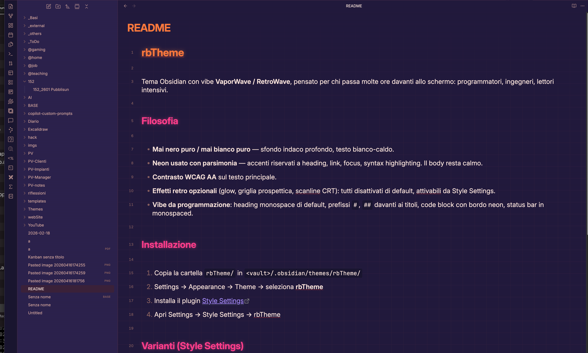
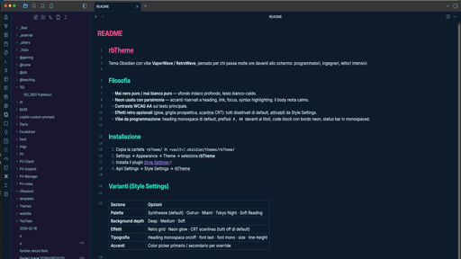

# rbWave

[English](README.md) • [Italiano](README_it.md)

An Obsidian theme with a **VaporWave / RetroWave** vibe, built for people who spend long hours at the screen: programmers, engineers, heavy readers.





## Philosophy

- **Never pure black, never pure white** — deep indigo background, warm off-white text.
- **Neon used sparingly** — accents reserved for headings, links, focus and syntax highlighting. Body copy stays calm.
- **WCAG AA contrast** on body text.
- **Optional retro effects** (glow, perspective grid, CRT scanlines): all off by default, toggle from Style Settings.
- **Programmer feel**: monospace headings by default, `#`/`##` prefixes on titles, code blocks with neon left border, monospaced status bar.

## Installation

1. Copy the `rbWave/` folder into `<vault>/.obsidian/themes/rbWave/`
2. Settings → Appearance → Theme → select **rbWave**
3. Install the [Style Settings](https://github.com/mgmeyers/obsidian-style-settings) plugin
4. Open Settings → Style Settings → rbWave

## Variants (Style Settings)

| Section | Options |
|---|---|
| **Palette** | Synthwave (default) · Outrun · Miami · Tokyo Night · Soft Reading |
| **Background depth** | Deep · Medium · Soft |
| **Effects** | Retro grid · Neon glow · CRT scanlines (all off by default) |
| **Typography** | Monospace headings on/off · text font · mono font · size · line-height |
| **Accents** | Color picker for primary / secondary override |

### Usage hints

- **Long coding sessions** → `Tokyo Night` or `Soft Reading` palette, glow off, depth medium.
- **Maximum retrowave vibe** → `Synthwave` + grid on + glow on (mind the headache after an hour).
- **Long reading** → `Soft Reading`, line-height 1.7, mono headings off.

## Structure

```
rbWave/
├── manifest.json
├── theme.css
├── LICENSE
├── README.md
└── README_it.md
```

## Callouts & checkboxes preview

> The blocks below render with full styling **only inside Obsidian**. GitHub renders a subset of callouts (NOTE / TIP / IMPORTANT / WARNING / CAUTION) and shows custom task markers as plain checkboxes.

### Callouts

> [!NOTE] Standard note
> Default block. Useful for general info that doesn't need extra emphasis.
> Syntax: `> [!NOTE]`

> [!TIP] Useful tip
> Use callouts to organize notes visually. They can be nested.
> Syntax: `> [!TIP]`

> [!IMPORTANT] Important
> Crucial information for understanding what follows.
> Syntax: `> [!IMPORTANT]`

> [!WARNING] Warning
> Pay attention — this could cause confusion if ignored.
> Syntax: `> [!WARNING]`

> [!CAUTION] Caution
> Proceed carefully. A wrong action here may cause data loss or major errors.
> Syntax: `> [!CAUTION]`

> [!ABSTRACT] Summary
> Ideal for executive summaries. `[!SUMMARY]` is an alias.
> Syntax: `> [!ABSTRACT]` or `> [!SUMMARY]`

> [!INFO] Info
> Technical details or supporting data.
> Syntax: `> [!INFO]`

> [!QUOTE] Quote
> "The best way to predict the future is to create it."
> Syntax: `> [!QUOTE]`

> [!SUCCESS] Success
> A process completed correctly or a hypothesis was verified.
> Syntax: `> [!SUCCESS]`

> [!QUESTION] Question
> Open question highlighted as such.
> Syntax: `> [!QUESTION]`

> [!FAILURE] Failure
> Something didn't work as expected, or a test failed.
> Syntax: `> [!FAILURE]`

> [!DANGER] Danger
> High risk. Use only for critical warnings.
> Syntax: `> [!DANGER]`

> [!BUG] Bug
> Track known software bugs in your notes.
> Syntax: `> [!BUG]`

> [!EXAMPLE] Example
> 1. Start with `> [!TYPE]`
> 2. Add content on following lines.
> Syntax: `> [!EXAMPLE]`

#### Collapsible callout

Add a `-` after the type to make it collapsed by default.

> [!TIP]- Click to expand
> Hidden until clicked. Good for long details or exercise solutions.
> Syntax: `> [!TIP]-`

### Custom checkboxes

#### Base states
- [ ] To-do (default) `[ ]`
- [x] Completed `[x]`
- [X] Completed (uppercase) `[X]`
- [-] Cancelled / N/A `[-]`

#### Priority & urgency
- [!] **URGENT** — immediate action `[!]`
- [>] Delegated to someone else `[>]`
- [<] Postponed / scheduled `[<]`
- [/] In progress `[/]`

#### Ideas & creativity
- [*] Brilliant idea / favourite `[*]`
- [l] Insight / lightbulb `[l]`
- [B] Brainstorming `[B]`
- [Y] Reflection / thought `[Y]`

#### Doubts & verification
- [?] Open question `[?]`
- [w] To review `[w]`
- [V] Verified `[V]`

#### Development & tech
- [b] Bug to fix `[b]`
- [f] Feature request / flag `[f]`
- [k] Key / password / critical `[k]`
- [S] Secure / locked `[S]`
- [c] Cloud / sync `[c]`

#### Time & organization
- [t] Target / goal `[t]`
- [D] Deadline / date `[D]`
- [O] Estimated time `[O]`
- [z] Snoozed `[z]`
- [R] To refresh `[R]`

#### Communication & info
- [i] General info `[i]`
- [n] Numeric note `[n]`
- [Q] Open discussion `[Q]`
- [u] User involved `[u]`
- [m] Place / map `[m]`

#### Misc
- [p] Pin / fixed `[p]`
- [d] To delete / trash `[d]`
- [C] Recycle / review `[C]`
- [E] External link / web `[E]`
- [F] Hot / trending `[F]`
- [H] Home / main `[H]`
- [J] Celebration `[J]`
- [K] Tool `[K]`
- [L] Reading / study `[L]`
- [M] Finance / cost `[M]`
- [N] Quick note `[N]`
- [P] Pin (variant) `[P]`
- [T] Ticket / support `[T]`
- [U] High priority (up) `[U]`
- [W] Manual work `[W]`
- [a] Audio / recorded `[a]`
- [e] Email to send `[e]`
- [s] Saved / bookmark `[s]`

## Author

**Ing. Roberto Bissanti** — aerospace engineer applied to renewable energy innovation (vertical-axis wind turbines, small wind systems, shape-memory alloys), based in Palermo, Sicily. Also a software developer for the cases the spreadsheet can't reach.

Mac user since 1989 — old enough to remember when "dark mode" meant the screen was off. The eyes are no longer twenty, hence rbWave.

- 📬 [roberto.bissanti@gmail.com](mailto:roberto.bissanti@gmail.com)
- 💼 [LinkedIn](https://www.linkedin.com/in/roberto-bissanti/)
- 🐙 [GitHub @robertobissanti](https://github.com/robertobissanti)

Issues, ideas and PRs are welcome on [github.com/robertobissanti/rbTheme](https://github.com/robertobissanti/rbTheme).

## License

[GPL v2](LICENSE) — use, fork, modify.
